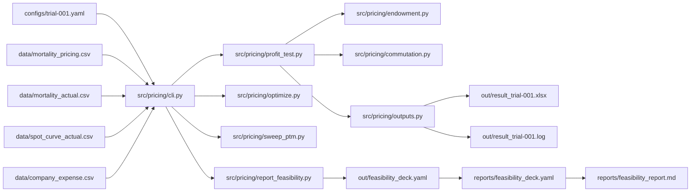
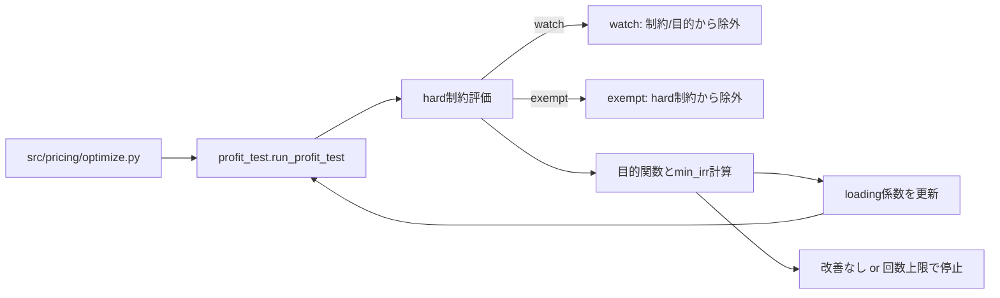

# pricing-automation

このリポジトリでできること（例）
```powershell
python -m pricing.cli report-feasibility configs\trial-001.yaml
```

## 1. これは何か
養老保険（endowment）を対象に、YAML設定とCSV入力から保険料・キャッシュフロー・IRR/NBV・制約評価を再現可能に実行する学習用リポジトリです。`src/pricing/cli.py` を入口に run/optimize/sweep-ptm/report-feasibility を実行し、`out/` と `reports/` に結果を出力します。

## 2. できること
- `configs/trial-001.yaml` と `data/*.csv` から収益性検証（IRR/NBV/費用充足）を実行し、Excelとログを出力できる
- alpha/beta/gamma 係数を最適化し、`configs/trial-001.optimized.yaml` を生成できる
- premium_to_maturity を掃引し、実現可能領域を `out/feasibility_deck.yaml` に数値として残せる
- `reports/feasibility_report.md` と `reports/pdca_log.md` で意思決定の記録を残せる

## 3. 最短実行
手順1: Python 3.11 以上を用意し、仮想環境を作成して有効化します。
```powershell
python -m venv .venv
.\.venv\Scripts\Activate.ps1
```

手順2: 依存関係をインストールします。
```powershell
pip install -e .
```

手順3: `tasks.ps1` で test/baseline/optimize/run/sweep を1コマンドで実行できます。
```powershell
powershell -ExecutionPolicy Bypass -File .\tasks.ps1 test
powershell -ExecutionPolicy Bypass -File .\tasks.ps1 baseline
```

補足: `AGENTS.md` は自走の目的順位、実行規律、報告フォーマットを定義した運用ルールです。PDCAや自動実験を行う場合は必ず参照してください。

## 4. 入力データの用意
`data/` にCSVを用意します。列名は以下のとおりです。
|ファイル|用途|必要な列|
|---|---|---|
|`data/mortality_pricing.csv`|予定死亡率|`age`, `q_male`, `q_female`|
|`data/mortality_actual.csv`|実績死亡率|`age`, `q_male`, `q_female`|
|`data/spot_curve_actual.csv`|スポット金利|`t`, `spot_rate`|
|`data/company_expense.csv`|会社費用|`year`, `new_policies`, `inforce_avg`, `premium_income`, `acq_var_total`, `acq_fixed_total`, `maint_var_total`, `maint_fixed_total`, `coll_var_total`, `overhead_total`|

ExcelからCSVを起こす場合は `scripts/bootstrap_from_excel.py` を使います（`data/golden/養老保険_収益性_RORC.xlsx` が存在する前提）。
```powershell
python scripts\bootstrap_from_excel.py --xlsx data\golden\養老保険_収益性_RORC.xlsx
```

仮想会社費用データを生成する場合は `scripts/generate_virtual_company_data.py` を使います。
```powershell
python scripts\generate_virtual_company_data.py --out data\company_expense.csv --seed 12345 --start-year 2025 --years 5
```

## 5. 設定ファイルの読み方
`configs/trial-001.yaml` は商品条件・モデルポイント・基礎率・出力・最適化設定をまとめたYAMLです。数値例はファイルに存在する値を引用しています。
```yaml
product:
  type: endowment
  premium_mode: annual
model_points:
  - id: male_age30_term35
    sex: male
    issue_age: 30
    term_years: 35
    premium_paying_years: 35
    sum_assured: 3000000
pricing:
  interest:
    type: flat
    flat_rate: 0.01
  mortality_path: data/mortality_pricing.csv
profit_test:
  discount_curve_path: data/spot_curve_actual.csv
  mortality_actual_path: data/mortality_actual.csv
outputs:
  excel_path: out/result_trial-001.xlsx
  log_path: out/result_trial-001.log
loading_alpha_beta_gamma:
  alpha: 0.03
  beta: 0.007
  gamma: 0.03
optimization:
  watch_model_point_ids:
    - male_age50_term20
  premium_to_maturity_hard_max: 1.05
  loading_surplus_hard_ratio: -0.10
  irr_hard: 0.0
  objective:
    mode: maximize_min_irr
```

主要キーの意味は以下です。
|キー|意味|
|---|---|
|`model_points`|モデルポイントの一覧（例: `male_age30_term35`, `sum_assured: 3000000`）|
|`pricing.interest.flat_rate`|予定利率（例: `0.01`）|
|`pricing.mortality_path`|予定死亡率CSVパス|
|`profit_test.discount_curve_path`|スポット金利CSVパス|
|`profit_test.mortality_actual_path`|実績死亡率CSVパス|
|`loading_alpha_beta_gamma`|alpha/beta/gamma を固定値で使う簡易入力|
|`optimization.watch_model_point_ids`|watch対象のモデルポイントID|
|`optimization.premium_to_maturity_hard_max`|premium_to_maturity の上限制約|
|`optimization.loading_surplus_hard_ratio`|loading_surplus_ratio の下限制約|
|`optimization.irr_hard`|IRRの下限制約|
|`optimization.objective.mode`|最適化の目的関数モード|

用語の定義は以下です。
|用語|定義|
|---|---|
|`premium_to_maturity`|`(gross_annual_premium * premium_paying_years) / sum_assured`。払込総額を満期保険金で割った比率|
|`IRR`|年次 `net_cf` シリーズから算出する内部収益率（`src/pricing/profit_test.py` で二分法）|
|`NBV`|割引後キャッシュフロー `pv_net_cf` の合計（新契約価値）|
|`loading_surplus`|`pv_loading - pv_expense`。付加保険料収入の現価から費用現価を引いた値|
|`loading_surplus_ratio`|`loading_surplus / sum_assured`。保険金額あたりの充足度|
|`watch`|最適化で hard 制約と目的関数の評価から除外されるが、結果はログに残るモデルポイント|
|`exempt`|免除判定により hard 制約から除外されるモデルポイント（`optimization.exemption` で制御）|

## 6. コマンド別の説明
### run
収益性検証を実行し、`out/result_trial-001.xlsx` と `out/result_trial-001.log` を出力します。
```powershell
python -m pricing.cli run configs\trial-001.yaml
```

### optimize
loading係数を最適化し、`configs/trial-001.optimized.yaml` を生成します。
```powershell
python -m pricing.cli optimize configs\trial-001.yaml
```

### sweep-ptm
premium_to_maturity（r）を掃引して IRR/NBV を比較します。
```powershell
python -m pricing.cli sweep-ptm configs\trial-001.yaml --model-point male_age30_term35 --start 1.0 --end 1.05 --step 0.01
python -m pricing.cli sweep-ptm configs\trial-001.yaml --all-model-points --start 1.0 --end 1.05 --step 0.01
```

### report-feasibility
実現可能領域の数値デッキを `out/feasibility_deck.yaml` に生成します。レビュー用の固定スナップショットは `reports/feasibility_deck.yaml` にコピーします。
```powershell
python -m pricing.cli report-feasibility configs\trial-001.yaml --out out\feasibility_deck.yaml
Copy-Item out\feasibility_deck.yaml reports\feasibility_deck.yaml -Force
```

## 7. 計算の全体像（データフロー）
YAML/CSV → CLI → 各モジュール → out の接続関係は以下です。


## 8. 最適化の全体像（optimize）
`src/pricing/optimize.py` が反復評価し、hard 制約を満たしつつ min_irr を改善します。watch/exempt の扱いも含めた流れは以下です。


## 9. 出力の読み方
`out/` は一時出力、`reports/` はGit追跡対象です。
|出力|役割|読みどころ|
|---|---|---|
|`out/result_trial-001.xlsx`|収益性検証のExcel|キャッシュフローとモデルポイント要約|
|`out/result_trial-001.log`|収益性検証ログ|IRR/NBV/費用充足の一覧|
|`configs/trial-001.optimized.yaml`|最適化済みYAML|`loading_parameters` と `optimize_summary`|
|`out/sweep_ptm_*.csv`|sweep結果|rごとの IRR/NBV/充足度|
|`out/feasibility_deck.yaml`|実現可能領域の数値デッキ|数値の一次資料|
|`reports/feasibility_deck.yaml`|追跡用数値デッキ|レビュー用スナップショット|
|`reports/feasibility_report.md`|手書きレポート|意思決定の根拠|
|`reports/pdca_log.md`|PDCA記録|変更履歴と結果|

## 10. よくある失敗と対処
|症状|原因|対処|
|---|---|---|
|CSVが見つからない|`data/` が未準備、またはパス誤り|`data/` を作成し、`configs/trial-001.yaml` のパスを確認|
|YAMLのキーが二重定義される|同じキーを複数回書いた|`loading_alpha_beta_gamma` などの重複定義を解消|
|モデルポイントが一致しない|`--model-point` が設定と不一致|`configs/trial-001.yaml` の `model_points.id` を確認|
|死亡率やスポットが欠損でエラー|CSVに欠損がある|`data/*.csv` の欠損行を補完|
|optimizeが長時間で止まらない|探索回数が多い|`optimization.bounds` の step と `max_iterations_per_stage` を調整|

## 11. 拡張の方針
|目的|触る場所|備考|
|---|---|---|
|別商品への拡張|`src/pricing/endowment.py`, `src/pricing/profit_test.py`|キャッシュフロー定義の追加が必要|
|別の基礎率|`data/*.csv`, `configs/*.yaml`|CSV列とパスを差し替え|
|別の最適化方針|`src/pricing/optimize.py`, `configs/*.yaml`|目的関数や制約を変更|
|可視化の拡張|`reports/*.md`, `reports/*.yaml`|数値デッキを基に手書きで整理|

Disclaimer 本リポジトリは、保険数理の学習およびPythonによる実装パターンの研究を目的として作成された個人の趣味プロジェクトです。 計算ロジックは一般的な教科書記述に基づいています。使用されているデータやパラメータはすべて架空のもの、または公開データに基づくものであり、実在する特定の商品・組織の数値とは一切関係ありません。
