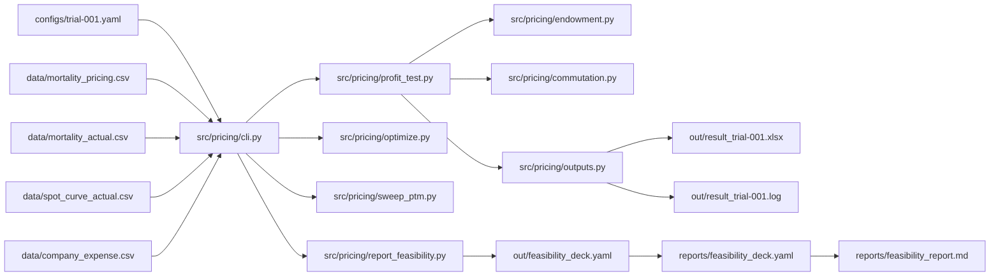
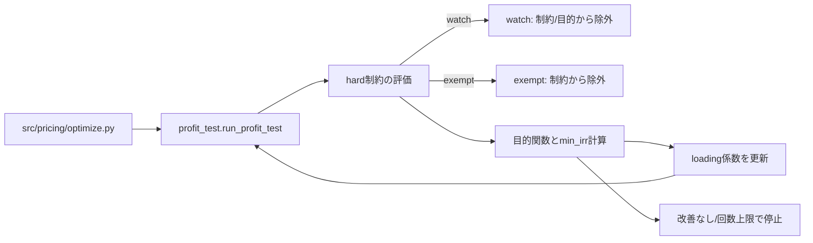

# pricing-automation

まずはこれで「このリポジトリで何ができるか」を体験できます。
```powershell
python -m pricing.cli report-feasibility configs/trial-001.yaml
```

## 1. これは何か
養老保険（endowment）の保険料計算と収益性検証（IRR/NBV/費用充足）を、設定ファイル（YAML）と入力CSVを使って再現可能に実行するための学習用リポジトリです。run/optimize/sweep/report-feasibility のCLIを通じて、モデルポイントごとの保険料・キャッシュフロー・制約評価を一貫して確認できます。

## 2. できること
- `configs/trial-001.yaml` を使った収益性検証（Excel/ログ出力）
- loading係数（alpha/beta/gamma）の最適化と最適化済みYAMLの生成
- premium_to_maturity を掃引して IRR/NBV の境界を可視化
- feasibilityデッキ（数値YAML）と手書きレポート（Markdown）の作成

## 3. 最短実行
1) Python 3.11 以上を用意し、仮想環境を作成して有効化します。
```powershell
python -m venv .venv
.\.venv\Scripts\Activate.ps1
```

2) 依存関係をインストールします。
```powershell
pip install -e .
```

3) `tasks.ps1` で実行を1コマンド化できます（test/baseline/optimize/run/sweep）。
```powershell
powershell -ExecutionPolicy Bypass -File .\tasks.ps1 test
powershell -ExecutionPolicy Bypass -File .\tasks.ps1 baseline
```

4) `AGENTS.md` はリポジトリ直下にあり、目的順位・実行規律・報告フォーマットを示します。自走の基準として参照してください。

## 4. 入力データの用意
`data/` は `.gitignore` 対象のため、実行環境ごとにCSVを用意します。必要なCSVと列は以下です。

|ファイル|用途|必須列|
|---|---|---|
|`data/mortality_pricing.csv`|予定死亡率|`age`, `q_male`, `q_female`|
|`data/mortality_actual.csv`|実績死亡率|`age`, `q_male`, `q_female`|
|`data/spot_curve_actual.csv`|スポット金利|`t`, `spot_rate`|
|`data/company_expense.csv`|会社費用|`year`, `new_policies`, `inforce_avg`, `premium_income`, `acq_var_total`, `acq_fixed_total`, `maint_var_total`, `maint_fixed_total`, `coll_var_total`, `overhead_total`|

ExcelからCSVを起こす場合は `scripts/bootstrap_from_excel.py` を使います。
```powershell
python scripts\bootstrap_from_excel.py --xlsx data\golden\養老保険.xlsx
```

仮想会社費用データを生成する場合は `scripts/generate_virtual_company_data.py` を使います。
```powershell
python scripts\generate_virtual_company_data.py --out data\company_expense.csv --seed 12345 --start-year 2025 --years 5
```

## 5. 設定ファイルの読み方
`configs/trial-001.yaml` は、商品条件・モデルポイント・基礎率・出力先・最適化設定をまとめたYAMLです。主な値の例を示します（実値はファイルに記載）。

```yaml
pricing:
  interest:
    type: flat
    flat_rate: 0.01
  mortality_path: data/mortality_pricing.csv

profit_test:
  discount_curve_path: data/spot_curve_actual.csv
  mortality_actual_path: data/mortality_actual.csv

loading_alpha_beta_gamma:
  alpha: 0.03
  beta: 0.007
  gamma: 0.03

optimization:
  premium_to_maturity_hard_max: 1.05
  loading_surplus_hard_ratio: -0.10
  irr_hard: 0.0
  objective:
    mode: maximize_min_irr
```

主要キーの意味は以下です。

|キー|意味（configs/trial-001.yaml 由来）|
|---|---|
|`model_points`|モデルポイントの一覧（例: `male_age30_term35`, `sum_assured: 3000000`）|
|`pricing.interest.flat_rate`|予定利率（例: `0.01`）|
|`pricing.mortality_path`|予定死亡率CSV（例: `data/mortality_pricing.csv`）|
|`profit_test.discount_curve_path`|スポット金利CSV（例: `data/spot_curve_actual.csv`）|
|`profit_test.mortality_actual_path`|実績死亡率CSV（例: `data/mortality_actual.csv`）|
|`loading_alpha_beta_gamma`|alpha/beta/gamma を直接指定する簡易入力（例: `alpha: 0.03`）|
|`optimization.premium_to_maturity_hard_max`|premium_to_maturity の上限制約（例: `1.05`）|
|`optimization.loading_surplus_hard_ratio`|loading_surplus_ratio の下限制約（例: `-0.10`）|
|`optimization.objective.mode`|最適化目的（例: `maximize_min_irr`）|

用語の定義は以下です。

|用語|定義|
|---|---|
|`premium_to_maturity`|`(総払込保険料) / (満期保険金額)`。総払込保険料は `gross_annual_premium * premium_paying_years`。|
|`IRR`|年次 `net_cf` シリーズの内部収益率。`profit_test.py` で二分法により算出。|
|`NBV`|`pv_net_cf` の合計（割引後キャッシュフローの合計）。|
|`loading_surplus`|`pv_loading - pv_expense`。付加保険料収入の現価から費用現価を引いた値。|
|`loading_surplus_ratio`|`loading_surplus / sum_assured`。保険金額あたりの充足度。|
|`watch`|最適化で hard 制約と目的関数の評価対象から除外されるが、結果はログに残るモデルポイント。|
|`exempt`|免除判定により hard 制約から除外されるモデルポイント（`optimization.exemption` により決定）。|

## 6. コマンド別の説明
### run（収益性検証）
`profit_test` を実行し、Excelとログを出力します。
```powershell
python -m pricing.cli run configs\trial-001.yaml
```

### optimize（loading係数の最適化）
hard 制約を満たしつつ min_irr を改善する係数を探索し、`*.optimized.yaml` を出力します。
```powershell
python -m pricing.cli optimize configs\trial-001.yaml
```

### sweep-ptm（premium_to_maturity の掃引）
指定モデルポイントまたは全件で r を掃引してIRR/NBVを比較します。
```powershell
python -m pricing.cli sweep-ptm configs\trial-001.yaml --model-point male_age30_term35 --start 1.0 --end 1.05 --step 0.01
python -m pricing.cli sweep-ptm configs\trial-001.yaml --all-model-points --start 1.0 --end 1.05 --step 0.01
```

### report-feasibility（実現可能領域のデッキ生成）
数値デッキを `out/feasibility_deck.yaml` に生成します。追跡用に `reports/` へコピーし、`reports/feasibility_report.md` は手作業で記述します。
```powershell
python -m pricing.cli report-feasibility configs\trial-001.yaml --out out\feasibility_deck.yaml
Copy-Item out\feasibility_deck.yaml reports\feasibility_deck.yaml -Force
```

## 7. 計算の全体像（データフロー）
このリポジトリは「YAML/CSV → CLI → 各モジュール → 出力」というつながりで動きます。ファイル同士の関係は以下です。



## 8. 最適化の全体像（optimize）
最適化は `src/pricing/optimize.py` 内で反復的に評価し、hard制約を満たしながら min_irr を改善する方針です。watch/exempt は評価対象の除外ルールとして使われます。



## 9. 出力の読み方
出力は `out/` と `reports/` に分かれます。`out/` は一時出力、`reports/` はGit追跡対象です。

|出力|内容|読みどころ|
|---|---|---|
|`out/result_trial-001.xlsx`|収益性検証のExcel|cashflowとモデルポイント要約|
|`out/result_trial-001.log`|収益性検証のログ|IRR/NBV/費用充足の一覧|
|`configs/trial-001.optimized.yaml`|最適化済みYAML|`loading_parameters` と `optimize_summary`|
|`out/sweep_ptm_*.csv`|sweep結果|rごとのIRR/NBV/充足度|
|`out/feasibility_deck.yaml`|実現可能領域の数値デッキ|数値の一次資料|
|`reports/feasibility_deck.yaml`|追跡用数値デッキ|レビュー対象の固定スナップショット|
|`reports/feasibility_report.md`|手書きレポート|意思決定の根拠と解釈|
|`reports/pdca_log.md`|PDCA記録|変更理由・結果の履歴|

## 10. よくある失敗と対処
|症状|原因|対処|
|---|---|---|
|CSVが見つからない|`data/` が未作成、またはパス誤り|Section 4 の手順でCSVを用意し、`configs/trial-001.yaml` のパスを確認|
|YAMLのキーが二重定義される|編集時の重複|同じキーを1回だけ残す（例: `loading_alpha_beta_gamma` を重複させない）|
|モデルポイントが一致しない|`--model-point` のIDが設定と不一致|`configs/trial-001.yaml` の `model_points.id` を確認|
|死亡率やスポットが不足でエラー|CSVに欠損がある|`data/*.csv` の欠損行を確認し補完|
|optimizeが長時間|探索回数が多い|`optimization.bounds` や `max_iterations_per_stage` を調整|

## 11. 拡張の方針
|目的|触る場所|備考|
|---|---|---|
|別商品（保険種目）|`src/pricing/endowment.py`, `src/pricing/profit_test.py`|キャッシュフロー定義の追加が必要|
|別の基礎率|`data/*.csv`, `configs/*.yaml`|CSV列とパスを変更|
|別の最適化方針|`src/pricing/optimize.py`, `configs/*.yaml`|目的関数や制約を変更|
|可視化の拡張|`reports/*.md`, `reports/*.yaml`|数値デッキを基に手書きで解釈|

Disclaimer 本リポジトリは、保険数理の学習およびPythonによる実装パターンの研究を目的として作成された個人の趣味プロジェクトです。 計算ロジックは一般的な教科書記述に基づいています。使用されているデータやパラメータはすべて架空のもの、または公開データに基づくものであり、実在する特定の商品・組織の数値とは一切関係ありません。
