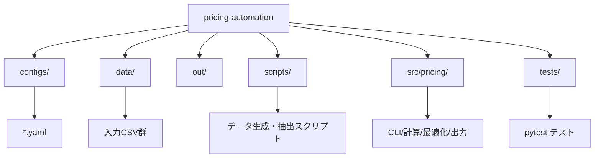
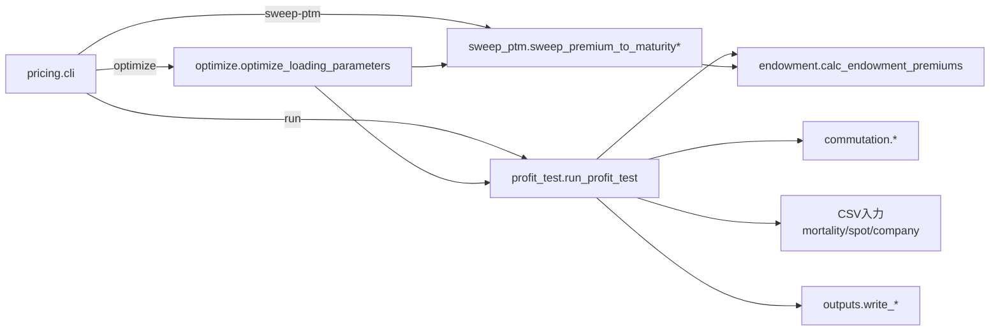

# pricing-automation

## 概要
養老保険（endowment）を対象に、保険料計算と収益性検証（プロフィットテスト）を自動化する
リポジトリです。モデルポイントごとに、IRR・新契約価値（NBV）・費用充足の指標を算出し、
負荷（alpha/beta/gamma）の最適化や premium-to-maturity 比率のスイープを行えます。

現状は養老保険のみ対応です。別種目を計算する場合は、商品ロジックを追加して拡張します。

## ディレクトリ構成
```
configs/    # 実行設定（YAML）
data/       # 入力データ（死亡率、スポット、会社費用）
out/        # 出力（Excel/CSV/ログ）
scripts/    # データ生成・Excel取り込み
src/pricing # 実装本体
tests/      # テスト
```



## 入力データ
すべてCSV。`configs/*.yaml` から参照されます。

- `data/mortality_pricing.csv` : 予定死亡率
  - columns: `age`, `q_male`, `q_female`
- `data/mortality_actual.csv` : 実績死亡率
  - columns: `age`, `q_male`, `q_female`
- `data/spot_curve_actual.csv` : スポットレート
  - columns: `t`, `spot_rate`
- `data/company_expense.csv` : 会社費用（年次）
  - columns: `year`, `new_policies`, `inforce_avg`, `premium_income`,
    `acq_var_total`, `acq_fixed_total`, `maint_var_total`, `maint_fixed_total`,
    `coll_var_total`, `overhead_total`

補助スクリプト:
- `scripts/generate_virtual_company_data.py` で仮想会社データを生成
- `scripts/bootstrap_from_excel.py` で `data/golden/養老保険_収益性_RORC.xlsx`
  からCSVを抽出

## 設定ファイル（YAML）
主要セクションは以下の通りです。

```
run:
  run_id: "trial-001"
  as_of: "2026-01-11"

product:
  type: "endowment"
  premium_mode: "annual"

model_points:
  - id: male_age30_term35
    sex: male
    issue_age: 30
    term_years: 35
    premium_paying_years: 35
    sum_assured: 3000000

pricing:
  interest:
    type: "flat"
    flat_rate: 0.01
  mortality_path: "data/mortality_pricing.csv"

loading_alpha_beta_gamma:
  alpha: 0.03
  beta: 0.007
  gamma: 0.03

profit_test:
  discount_curve_path: "data/spot_curve_actual.csv"
  mortality_actual_path: "data/mortality_actual.csv"
  expense_model:
    company_data_path: "data/company_expense.csv"
    overhead_split:
      acquisition: 0.5
      maintenance: 0.5

outputs:
  excel_path: "out/result.xlsx"
  log_path: "out/result.log"

optimization:
  watch_model_point_ids:
    - male_age50_term20
  premium_to_maturity_hard_max: 1.05
  loading_surplus_hard_ratio: -0.10
  nbv_hard: 0.0
  irr_hard: 0.0
  objective:
    mode: "maximize_min_irr"
```

ポイント:
- `model_points` が複数ある場合は一括で計算。1件だけなら `model_point` 単体定義も可。
- `loading_alpha_beta_gamma` を直接指定するか、`loading_parameters` / `loading_function` で係数関数を指定可能。
  - `loading_parameters` は「保険料倍率」ではなく、alpha/beta/gammaの係数です。
- `profit_test.expense_model.mode` は `company` または `loading`。
  - `company` は `company_expense.csv` から費用単価を推定。
  - `loading` は alpha/beta/gamma を費用として使う。

最適化設定の補足:
- hard 制約: `irr_hard`, `loading_surplus_hard`/`loading_surplus_hard_ratio`,
  `premium_to_maturity_hard_max`, `nbv_hard`
- soft 目標: `irr_target`, `premium_to_maturity_target`, `premium_to_maturity_soft_min`
- `optimization.stages` / `bounds` で係数探索の段階と範囲を制御。
- `optimization.objective.mode` で目的関数のモードを切替。
- `optimization.exemption.enabled` を有効にすると、sweep結果で不適合なモデルポイントを除外。

## 実行方法
`src/` がパッケージのため、実行時に `PYTHONPATH=src` を設定します。

```powershell
$env:PYTHONPATH = "src"

# 収益性検証（Excel/ログ出力）
python -m pricing.cli run configs/trial-001.yaml

# 負荷パラメータ最適化（ログ＋optimized YAML）
python -m pricing.cli optimize configs/trial-001.yaml

# premium-to-maturity スイープ（特定モデルポイント）
python -m pricing.cli sweep-ptm configs/trial-001.yaml `
  --model-point male_age30_term35 --start 1.0 --end 1.05 --step 0.01

# 全モデルポイントを一括スイープ
python -m pricing.cli sweep-ptm configs/trial-001.yaml `
  --all-model-points --start 1.0 --end 1.05 --step 0.01
```

出力:
- `run`: `outputs.excel_path` と `outputs.log_path`
- `optimize`: `outputs.log_path` と `*.optimized.yaml`（`optimized_config_path` 未指定時）
- `sweep-ptm`: `out/sweep_ptm_{model_point}.csv` / `out/sweep_ptm_all.csv`

## 任意のモデルポイントで保険料等を算出する手順
1. `configs/*.yaml` の `model_points` に対象条件を追加。
2. `pricing`（金利・死亡率）と `profit_test`（割引曲線・実績死亡率・費用モデル）を設定。
3. `loading_alpha_beta_gamma` もしくは `loading_parameters` を指定。
4. `python -m pricing.cli run <config>` を実行。

同一商品内のモデルポイント追加だけなら上記で完結します。

## 別種目（商品タイプ）を算出したい場合
本実装は養老保険のみ対応です。別種目を計算するには以下の拡張が必要です。

1. `src/pricing/` に新しい商品ロジック（キャッシュフロー、準備金、保険料計算）を追加
2. `profit_test.py` を商品タイプに応じて分岐
3. `configs/*.yaml` に商品別の入力項目を追加
4. テスト（`tests/`）に商品別の検証を追加

## ロジック概要

- `endowment.py`: 予定死亡率と金利から A, a を計算し、保険料を算出
  - `gross_rate = (net_rate + alpha/a + beta) / (1 - gamma)`
- `profit_test.py`: 実績死亡率・割引曲線・費用モデルを用いて年次キャッシュフローを作成
  - `irr`, `new_business_value`, `loading_surplus`, `premium_to_maturity_ratio` を算出
- `optimize.py`: 係数探索（段階的グリッド探索）で hard 制約と soft 目的を満たす loading を探索
- `sweep_ptm.py`: premium-to-maturity 比率を動かして IRR 等の感度を評価

## テスト
```powershell
$env:PYTHONPATH = "src"
pytest
```

## 主な実装ファイル
- `src/pricing/cli.py`: CLI（run/optimize/sweep-ptm）
- `src/pricing/profit_test.py`: 収益性検証本体
- `src/pricing/endowment.py`: 養老保険の保険料計算
- `src/pricing/optimize.py`: loading 最適化
- `src/pricing/sweep_ptm.py`: premium-to-maturity スイープ
- `src/pricing/virtual_company.py`: 仮想会社費用データ生成
