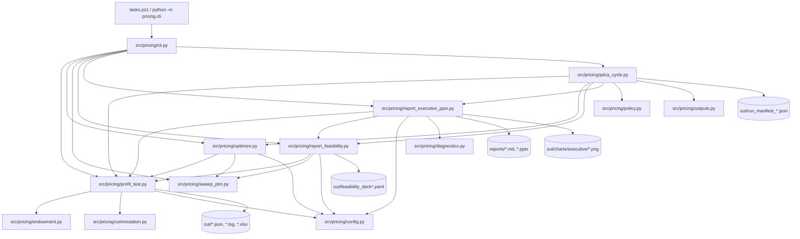

# Script Relationship Memo

このメモは、`pricing-automation` のスクリプト間関係を「入口 -> 計算本体 -> 出力」の順で追えるように整理したものです。  
まずは `tasks.ps1` / `src/pricing/cli.py` から読み始めると全体像を掴みやすいです。

## 1. 全体アーキテクチャ（1枚図）

## 2. 入口スクリプトの関係

| 入口 | 主な役割 | 呼び先 |
|---|---|---|
| `tasks.ps1` | 運用ショートカット (`test`, `run`, `optimize`, `executive`, `cycle` など) | `python -m pricing.cli ...` |
| `src/pricing/cli.py` | 主要CLIエントリーポイント | `profit_test`, `optimize`, `sweep_ptm`, `report_*`, `pdca_cycle` |
| `scripts/bootstrap_from_excel.py` | ゴールデンExcelから入力CSV抽出 | `data/mortality_pricing.csv`, `data/mortality_actual.csv`, `data/spot_curve_actual.csv` を生成 |
| `scripts/generate_virtual_company_data.py` | 仮想会社費用データ生成 | `pricing.virtual_company` を呼んで `data/company_expense.csv` を生成 |

## 3. CLIコマンド別の呼び出し経路

### `run`

`cli.py:run_from_config`  
-> `profit_test.run_profit_test`  
-> `outputs.write_profit_test_excel` / `outputs.write_profit_test_log` / `outputs.write_run_summary_json`  
-> `diagnostics.build_run_summary`

### `optimize`

`cli.py:optimize_from_config`  
-> `optimize.optimize_loading_parameters`  
-> 内部で `profit_test.run_profit_test` を反復実行（必要に応じて `sweep_ptm.sweep_premium_to_maturity_all`）  
-> `outputs.write_optimize_log` + `optimize.write_optimized_config`

### `sweep-ptm`

`cli.py:sweep_ptm_from_config`  
-> `sweep_ptm.sweep_premium_to_maturity` または `sweep_premium_to_maturity_all`  
-> 各点で `profit_test.run_profit_test` を呼んでCSV化

### `report-feasibility`

`cli.py`  
-> `report_feasibility.report_feasibility_from_config`  
-> `build_feasibility_report`  
-> `sweep_ptm._calc_sweep_metrics` + `profit_test.run_profit_test`  
-> `out/feasibility_deck*.yaml` を出力

### `report-executive-pptx`

`cli.py`  
-> `report_executive_pptx.report_executive_pptx_from_config`  
-> `run_profit_test` + `diagnostics.build_run_summary` + `build_feasibility_report`  
-> 感度分析シナリオ実行  
-> Markdown/PPTX/PNG/JSON/YAML をまとめて出力

### `run-cycle`

`cli.py`  
-> `pdca_cycle.run_pdca_cycle`  
-> (既定) `python -m pytest -q`  
-> baseline `run_profit_test`  
-> 必要なら `optimize` 実行  
-> `report_feasibility` / `report_executive_pptx`  
-> `out/run_manifest_*.json` と `reports/pdca_log.md` 更新

### `propose-change`

`cli.py:propose_change_from_config`  
-> baseline と変更後の2回 `run_profit_test`  
-> `diagnostics.build_run_summary` 比較  
-> `out/propose_change.json`

## 4. 中核モジュールの責務分担

| モジュール | 責務 | 主な利用元 |
|---|---|---|
| `src/pricing/profit_test.py` | 年度CF、IRR、NBV、PTM、loading surplus 計算 | `cli`, `optimize`, `sweep_ptm`, `report_*`, `pdca_cycle` |
| `src/pricing/endowment.py` | A/a と net/gross premium の数式実装 | `profit_test`, `config`, `report_executive_pptx` |
| `src/pricing/commutation.py` | 死亡率テーブル変換、生存確率計算 | `endowment`, `profit_test` |
| `src/pricing/config.py` | 最適化/免除/loading 設定の読み取り | `cli`, `profit_test`, `optimize`, `diagnostics`, `report_*`, `outputs` |
| `src/pricing/diagnostics.py` | 構造化サマリ (`run_summary`) 生成 | `cli`, `report_executive_pptx`, `pdca_cycle`, `outputs` |
| `src/pricing/outputs.py` | Excel/ログ/JSON出力ユーティリティ | `cli`, `pdca_cycle` |
| `src/pricing/optimize.py` | loading係数探索と最適化済みconfig出力 | `cli`, `pdca_cycle` |
| `src/pricing/sweep_ptm.py` | PTMスイープ実行とmin-r探索 | `cli`, `optimize`, `report_feasibility` |
| `src/pricing/report_feasibility.py` | feasibility deck (YAML) 生成 | `cli`, `pdca_cycle`, `report_executive_pptx` |
| `src/pricing/report_executive_pptx.py` | 経営向け Markdown/PPTX/グラフ生成 | `cli`, `pdca_cycle` |
| `src/pricing/policy.py` | PDCA自動実行ポリシー読込 | `pdca_cycle` |
| `src/pricing/paths.py` | config基準のbase_dir解決 | `cli`, `report_*`, `pdca_cycle` |
| `src/pricing/virtual_company.py` | 会社費用ダミーデータ生成 | `scripts/generate_virtual_company_data.py` |
| `src/pricing/io.py` | 現在はプレースホルダ | 現状未使用 |

## 5. 主要な入出力フロー

### 入力

- `configs/*.yaml`
- `data/mortality_pricing.csv`
- `data/mortality_actual.csv`
- `data/spot_curve_actual.csv`
- `data/company_expense.csv`
- `policy/pricing_policy.yaml`（`run-cycle`時）

### 出力（代表）

- `run`:
  - `out/result*.xlsx`
  - `out/result*.log`
  - `out/run_summary*.json`
- `optimize`:
  - `out/result*.log`
  - `configs/*.optimized.yaml` または `out/*.optimized_*.yaml`
- `sweep-ptm`:
  - `out/sweep_ptm*.csv`
- `report-feasibility`:
  - `out/feasibility_deck*.yaml`
- `report-executive-pptx`:
  - `reports/feasibility_report*.md`
  - `reports/executive_pricing_deck*.pptx`
  - `out/run_summary_executive*.json`
  - `out/feasibility_deck_executive*.yaml`
  - `out/charts/executive/**/*.png`
- `run-cycle`:
  - `out/run_manifest_*.json`
  - `reports/pdca_log.md`
  - 上記成果物の一式

## 6. 変更時の「どこを触るか」早見表

| 変更したい内容 | まず触る場所 | 次に見る場所 |
|---|---|---|
| 保険料式の変更 | `src/pricing/endowment.py` | `src/pricing/profit_test.py`, `tests/test_against_excel.py` |
| 制約・目的関数の変更 | `src/pricing/config.py`, `src/pricing/optimize.py` | `src/pricing/diagnostics.py`, `tests/test_optimize_exemption.py` |
| 出力JSONの項目追加 | `src/pricing/diagnostics.py` | `src/pricing/outputs.py`, `tests/test_diagnostics.py` |
| 実現可能性レポート項目追加 | `src/pricing/report_feasibility.py` | `src/pricing/report_executive_pptx.py`, `tests/test_report_feasibility.py` |
| 経営向けPPTXの構成変更 | `src/pricing/report_executive_pptx.py` | `tests/test_report_executive_pptx.py` |
| PDCA自動実行ルール変更 | `src/pricing/policy.py`, `src/pricing/pdca_cycle.py` | `policy/pricing_policy.yaml`, `tests/test_pdca_cycle.py` |

## 7. テストとの対応

- `tests/test_cli_integration.py`: CLIのエンドツーエンド出力確認
- `tests/test_report_feasibility.py`: feasibility deck生成の妥当性
- `tests/test_report_executive_pptx.py`: markdown/pptx/chart出力確認
- `tests/test_pdca_cycle.py`: run-cycle生成物（manifest等）確認
- `tests/test_diagnostics.py`: run_summary構造の確認
- `tests/test_optimize_exemption.py`: 最適化 + exemption挙動確認
- `tests/test_sweep_ptm.py`: PTM sweepロジック確認

## 8. 現在の複雑化ポイント（把握用）

- `report_executive_pptx.py` は責務が広い（計算再実行、感度分析、Markdown、PPTX、図表生成）。
- `cli.py` はサブコマンド追加に伴って分岐が増えている。
- `io.py` はプレースホルダで、実体のI/O関数は `outputs.py` / `diagnostics.py` / 各reportモジュールに分散している。

